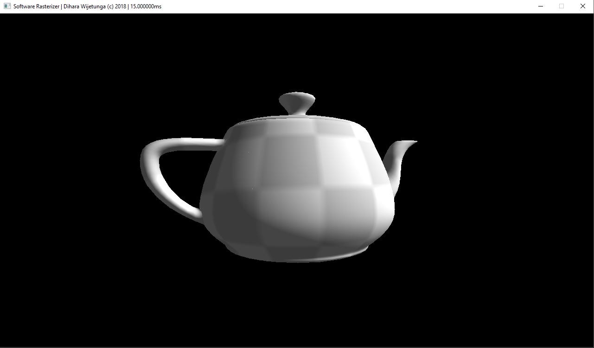

# Rasterator

[](https://opensource.org/licenses/MIT)

## What is it?
A Real-time, C++ toy software rasterizer created for understanding the graphics pipeline.

## Features
* Near-complete implementation of the graphics pipeline
* Interactive framerates
* Depth buffering
* Perspective-correct vertex attribute interpolation
* OpenMP multithreading
* Texture mappingk
* Bilinear texture filtering
* Cross platform (Windows, macOS, Linux, Emscripten)

## Screenshots


## Building

### Windows/macOS/Linux
Recursively clone the repository and use CMake to generate a project of your choice.

### Emscripten
Make sure to have the Emscripten SDK installed. Then use CMake with the Emscripten toolchain to generate a makefile (or MinGW makefile on Windows).

NOTE: Emscripten build is pretty slow, so use a lower resolution.

## Roadmap
* SIMD Acceleration (SSE/AVX)
* Normal mapping
* Specular mapping
* Trilinear texture filtering

## Dependencies
* [SDL2](https://www.libsdl.org/download-2.0.php)
* [Assimp](https://github.com/assimp/assimp) 
* [stb](https://github.com/nothings/stb) 

## License
```
Copyright (c) 2018 Dihara Wijetunga

Permission is hereby granted, free of charge, to any person obtaining a copy of this software and 
associated documentation files (the "Software"), to deal in the Software without restriction, 
including without limitation the rights to use, copy, modify, merge, publish, distribute, sublicense,
and/or sell copies of the Software, and to permit persons to whom the Software is furnished to do so, 
subject to the following conditions:

The above copyright notice and this permission notice shall be included in all copies or substantial
portions of the Software.

THE SOFTWARE IS PROVIDED "AS IS", WITHOUT WARRANTY OF ANY KIND, EXPRESS OR IMPLIED, INCLUDING BUT NOT 
LIMITED TO THE WARRANTIES OF MERCHANTABILITY, FITNESS FOR A PARTICULAR PURPOSE AND NONINFRINGEMENT. 
IN NO EVENT SHALL THE AUTHORS OR COPYRIGHT HOLDERS BE LIABLE FOR ANY CLAIM, DAMAGES OR OTHER LIABILITY,
WHETHER IN AN ACTION OF CONTRACT, TORT OR OTHERWISE, ARISING FROM, OUT OF OR IN CONNECTION WITH THE 
SOFTWARE OR THE USE OR OTHER DEALINGS IN THE SOFTWARE.
```